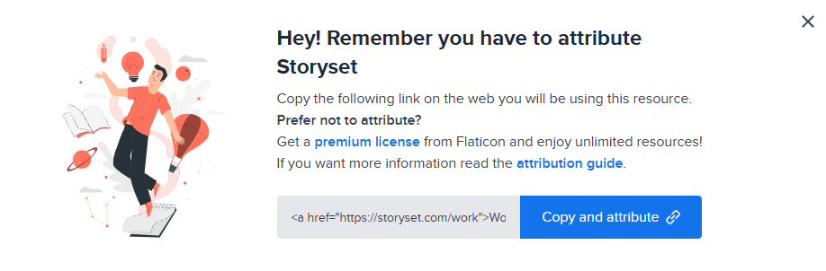

<a id="readme-top"></a>

<!-- HEADER -->
<br />
<div align="center">
		
	<h1 align="center">MeowPath </h1>
	<p align="center">
		Introducing MeowPath,a website for beginners to help to find the tutorials for software and also in hardware.
		<br />
		You can find different tutorials in this!
		<br />
		<br />
	</p>
    <br>
    <p>
    Hi i created this because when i was new to coding i  don't know where to start,which tutorial should i watch
      this is a solution for that.I know i don't know every dev lang but i choosed all the tutorials by views and their 
      comments also looked reddit for suggestion and also you want to search the resources your own it is worth .I am also studied  some js
    </p>
</div>

<!-- CONTENTS -->
<details>
	<summary>Table of Contents</summary>
	<ol>
		<li>
			<a href="#about">About The Project</a>
			<ul>
				<li><a href="#built-with">Built Using</a></li>
			</ul>
		</li>
		<li>
			<a href="#getting-started">Getting Started</a>
			<ul>
				<li><a href="#installation">Installation</a></li>
			</ul>
		</li>
		<li><a href="#license">License</a></li>
	</ol>
</details>


## Live Demo

[Open the live website](https://raphelreji.github.io/MeowPath/)


<!-- ABOUT -->
## About The Project
<br />


This website will help you to find tutorials
<br />
Here's why:
* Selected with views,comments etc...
* The website is divided into sections for choosing a learning goal, browsing tutorials, and exploring what can be built.
* It has Toggle
* It has tutorial filter box
* Details about what you can build
* responsive UI

<p align="right">(<a href="#readme-top">top</a>)</p>

### Built Using
I used the HTML,CSS and little bit of js for only the filter! happy to use these three as i know something<br />
* HTML
* CSS
* JAVASCRIPT

<p align="right">(<a href="#readme-top">top</a>)</p>

<!-- GETTING STARTED -->
## Getting Started
How to download and edit this ? It's easy!

### Installation
 you can manually install it, here's how to do it!
1. Clone the repository
	```sh
	git clone https https://github.com/RaphelReji/MeowPath.git
	```
2. Open the project folder in VS Code or any code editor.

3. Open `index.html` in your browser.

<p align="right">(<a href="#readme-top">top</a>)</p>


## Credits

 - images from storyset [Open storyset](https://storyset.com/)
 - icons:Taken from icon8 [Open icon8](https://icons8.com/)


## Research/inspiration

* Reddit suggestions
*  from youtube
<!-- LICENSE -->
## License

Distributed under the MIT License. See `LICENSE` for more information.

<p align="right">(<a href="#readme-top">back to top</a>)</p>
