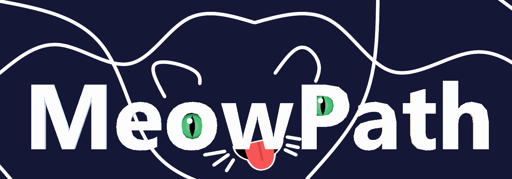
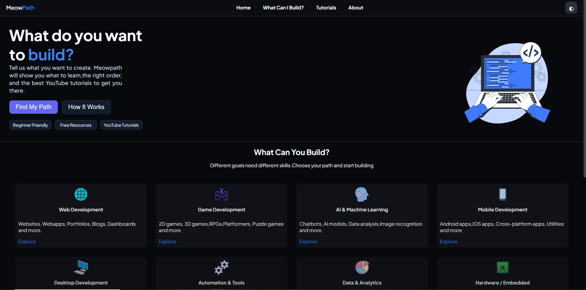
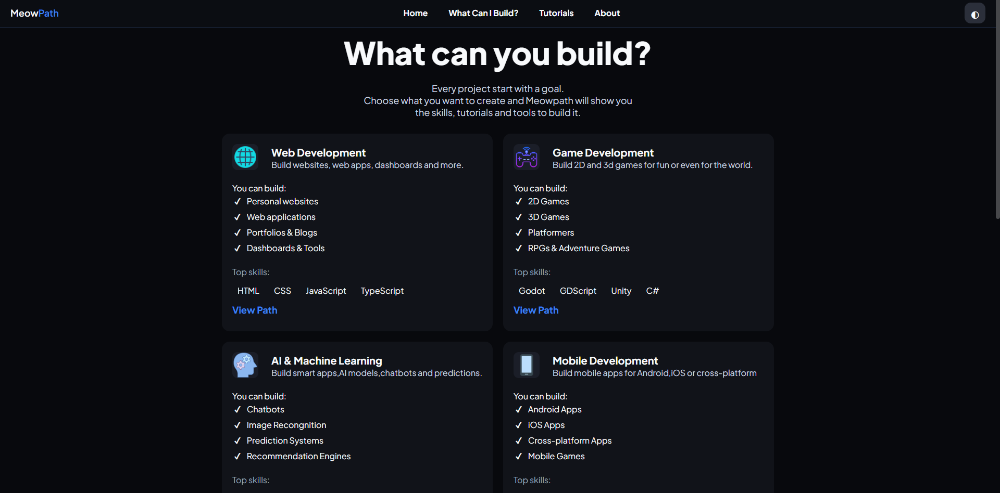
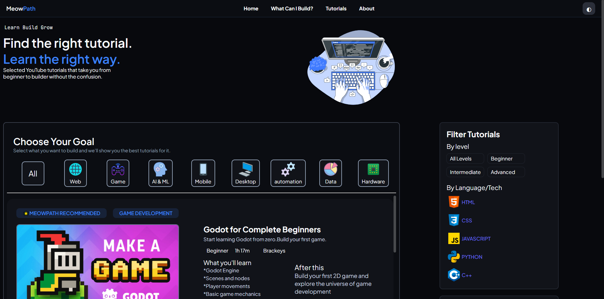

<a id="readme-top"></a>

<!-- HEADER -->
<br />
<div align="center">
	<a href="https://github.com/BudzioT/Godot_Super-Wakatime">
		
	</a>
	<h1 align="center">MeowPath </h1>
	<p align="center">
		A  beginner friendly website  to find free and best tutorials for software and hardware projects and more
		<br />
		You can find different tutorials in this!
		<br />
		<br />
	</p>
    <br>
    <p>
    Hi i created this because when i was new to coding i  don't know where to start,which tutorial should i watch
      this is a solution for that.I know i don't know every dev lang but i choosed all the tutorials by views and their 
      comments also looked reddit for suggestion and also you want to search the resources your own it is worth .I am also studied  some js
    </p>
</div>

<!-- CONTENTS -->
<details>
	<summary>Table of Contents</summary>
	<ol>
		<li>
			<a href="#about">About The Project</a>
			<ul>
				<li><a href="#built-with">Built Using</a></li>
			</ul>
		</li>
		<li>
			<a href="#getting-started">Getting Started</a>
			<ul>
				<li><a href="#installation">Installation</a></li>
			</ul>
		</li>
		<li><a href="#license">License</a></li>
	</ol>
</details>


<!-- ABOUT -->
## About The Project
<br />





This website will help you to find best and awesome tutorials
<br />
Here's why:
* It has best youtube tutorials
* Selected with views,comments etc...
* It has 4 main pages and lot of subpages
* It has Toogle
* It has tutorial filter box
* Details about what you can build
* In the future it will also have ai to help

<p align="right">(<a href="#readme-top">top</a>)</p>

### Built Using
I used the HTML,CSS and JS!<br />
* HTML
* CSS
* JAVASCRIPT

<p align="right">(<a href="#readme-top">top</a>)</p>

<!-- GETTING STARTED -->
## Getting Started
How to download and edit this ? It's easy!

### Installation
 you can manually install it, here's how to do it!
1. Clone the repository
	```sh
	git clone https
	```
2. Open the project folder in VS Code or any code editor.

3. Open `index.html` in your browser.

<p align="right">(<a href="#readme-top">top</a>)</p>

<!-- LICENSE -->
## License

Distributed under the MIT License. See `LICENSE` for more information.

<p align="right">(<a href="#readme-top">back to top</a>)</p>
